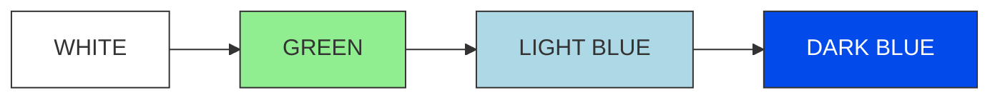
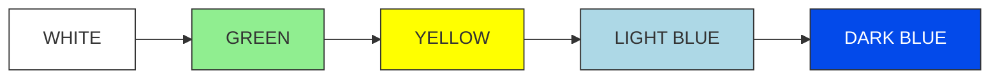
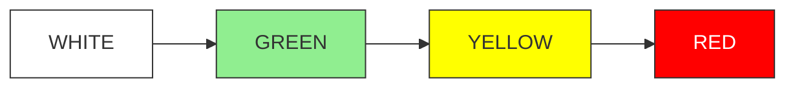
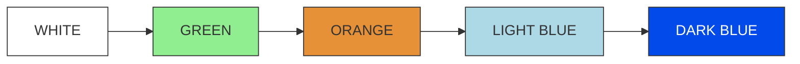
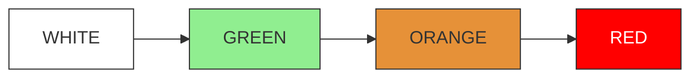
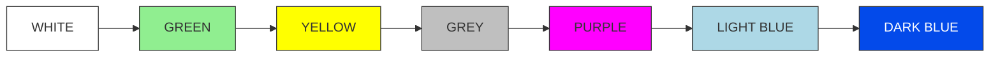
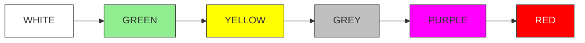

# GABLE: Google Apps Script Longitudinal Participant Management

GABLE is a Google Apps Script framework for managing participants in longitudinal online experiments. It automates scheduling, reminders, session tracking, and incentive workflows so researchers can focus on building their experimental task.

> GABLE manages participants and study flow. You are responsible for building and hosting the task webpage.

## Features

- Tracks multisession progress per participant
- Sends automated reminder and status emails
- Activates sessions based on configurable schedules
- Logs all activity in a Google Sheet
- Reads participant progress from your chosen storage backend
- Supports automated gift card tracking and payouts

## Quick Start

### 1. Google Apps Script Setup

1. Create a new Google Sheet
2. Go to Extensions → Apps Script
3. Copy all `.js` files into the project
4. Update `config.js`
5. Run `initialize()`
6. Confirm setup via email

### Essential Configuration (config.js)

At the top of `config.js`, set:

- `NUM_SESSIONS`
- `NUM_GROUPS`
- `DAYS_INTERVAL`
- `GROUPS_MAPPING`

Your study definition stays exactly as before:

```javascript
STUDIES = {
  GABLE_01: {
    name: "Your Study Name",
    admin_name: "Your Name",
    website: "https://your-task-page.com",
    preexperiment: "https://your-qualtrics-link.com",
    email: "your-email@example.com",
    folderID: "your-google-drive-folder-id",
    adminCalendarId: "your-calendar-id@google.com",

    sasToken: "?sv=xxxx",
    storageAccountName: "your-storage-account",
    storageContainer: "your-container-name",

    groups: {
      number: NUM_GROUPS,
      numSessions: NUM_SESSIONS,
      giftCardAmountPerSession: 5,
      giftCardAmountAfterCompletion: 100
    }
  }
};
```

The three storage fields above were originally described as Azure related. You can keep them as is or adapt them for any backend as long as your storage helper functions know how to use them. GABLE only requires the ability to read and write JSON.

## Integration with Your Task Webpage

Your task saves a JSON state file for each participant. It can be stored in Azure, AWS, GCP, Firebase, or any storage reachable through HTTP fetch. The filename format is customizable; in the current implementation it follows:

```
pID{userId}_gable.json
```

### Required JSON Structure

```json
{
  "userId": "fa4ae08",
  "group": "G11",
  "sessionNumber": 1,
  "trialNumber": 5,
  "firstTrialStartTime": "12/10/2025 10:35:00 AM",
  "sessionCompleted": true,
  "trialCompleted": true,
  "accountTerminated": false,
  "lastTrialCompletedTime": "12/10/2025 11:35:00 AM",
  "lastSessionCompletedTime": "12/10/2025 11:35:00 AM",
  "sessionActivationTime": "12/10/2025 10:30:00 AM",
  "latestSubmissionTime": "",
  "loginData": [],
  "trialStartTimesData": {},
  "trialCompletedTimesData": {},
  "sessionStartTimes": {},
  "sessionCompletedTimes": {}
}
```

### Fields Your Task Must Maintain

| Field | Description | Updated by |
|-------|-------------|------------|
| `sessionNumber` | Current session | Task |
| `trialNumber` | Current trial | Task |
| `sessionCompleted` | Session finished | Task |
| `trialCompleted` | Trial finished | Task |
| `firstTrialStartTime` | First trial time | Task |
| `lastTrialCompletedTime` | Last trial time | Task |
| `lastSessionCompletedTime` | Session completion time | Task |
| `latestSubmissionTime` | Every save | Task |
| `sessionActivationTime` | When session opened | GABLE |
| `accountTerminated` | Removed or dropped | Admin |

### Initial File Created by GABLE

```json
{
  "sessionNumber": 0,
  "trialNumber": 0,
  "sessionCompleted": true,
  "trialCompleted": true
}
```

## Workflow

1. **Sign up**: GABLE writes the participant to the Sheet and creates the initial JSON file
2. **Session activation**: GABLE opens the next session based on your timing rules
3. **Task participation**: Your webpage updates the JSON as the participant progresses
4. **Monitoring and email**: Scheduled checks read the JSON file and update Sheets and emails
5. **Completion and incentives**: Gift card logic tracks progress and completion payments

## Session Status Colors

GABLE uses color codes to track participant session states. Each color represents a specific stage in the session lifecycle:

- $${\color{lightblue}LIGHT \space BLUE}$$: Session completed and data saved to cloud database, but completion emails not yet sent.
- $${\color{blue}DARK \space BLUE}$$: Session completed, data saved to cloud database, and completion emails sent to participants.
- $${\color{yellow}YELLOW}$$: Session not started with 1 day remaining until due date. Reminder emails sent to participants.
- $${\color{black}WHITE}$$: Next session date calculated but session notification email not yet sent to participant.
- $${\color{orange}ORANGE}$$: Session started but left incomplete for 24 hours. Incomplete session email sent to participant.
- $${\color{red}RED}$$: Participant invalidated due to session not completed on time. Invalidation email and gift cards sent.
- $${\color{green}GREEN}$$: Next session email sent to participant, including calendar invite and session begin/end dates.
- $${\color{grey}GREY}$$: Grace period granted (3 days in current implementation) for sessions after session 14.
- $${\color{purple}PURPLE}$$: Grace period previously granted with 1 day remaining before grace period expires.

### Common Session Flow Scenarios

**Color Legend:**
- WHITE: Next session date calculated
- GREEN: Next session email sent
- YELLOW: Reminder email sent
- ORANGE: Incomplete session detected
- LIGHT BLUE: Session completed & data saved
- DARK BLUE: Completion emails sent
- GREY: Grace period given
- PURPLE: Grace period reminder
- RED: Session invalidated & gift cards sent

#### 1. Successfully completed session on time:



#### 2. Successfully completed but reminder email sent:



#### 3. Session not completed with reminder email:



#### 4. Successfully completed after incomplete session:



#### 5. Session not completed after incomplete session:



#### 6. After session 15: Completed after grace period reminder



#### 7. After session 15: Not completed after grace period reminder



## Time Based Triggers

Initialization creates triggers that:

- Activate sessions
- Send reminders
- Poll the storage JSON files
- Update Sheets
- Create optional summaries

## Testing and Customization

### Testing

Use a few test participants and confirm session changes, email behavior, and JSON updates.

### Customization

Edit in `config.js` and email templates:

- Session spacing
- Group definitions
- Payout amounts
- Allowed windows for completion
- Storage helper functions

## Citation

If you use GABLE in published work, please cite the following manuscript:

> Berber, I., Kas, I., Sepuri, T., Macnamara, B. N., Çavuşoğlu, M. C., Wilson-Delfosse, A. L., Krupinski, E. A., Smith, P. J., & Ray, S. (under review). GABLE: Lightweight infrastructure for longitudinal experiments using Google Apps Script. *Behavior Research Methods*.

## License

This software is licensed under the GNU General Public License v3.0 (GPL-3.0).
Commercial use is strictly prohibited without prior written permission 
from the authors.

This license includes an additional non-commercial restriction that supersedes 
the sections of GPL-3.0 permitting commercial use.

For full license terms, see the LICENSE file.