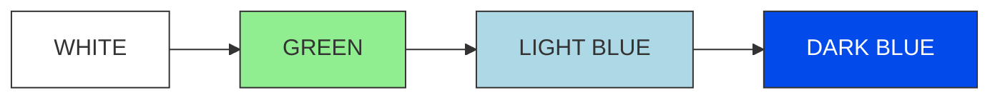
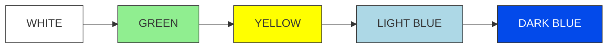
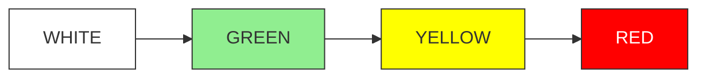
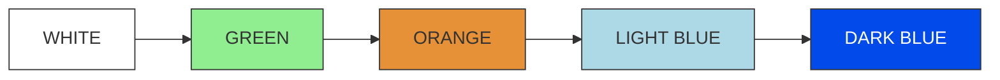
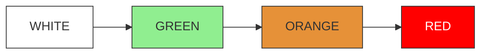
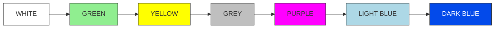
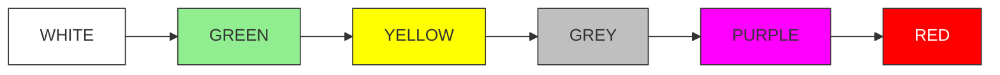

# GABLE: Google Apps Script Longitudinal Participant Management

GABLE is a Google Apps Script framework for managing participants in longitudinal online experiments. It automates scheduling, reminders, session tracking, and incentive workflows so researchers can focus on building their experimental task.

> GABLE manages participants and study flow. You are responsible for building and hosting the task webpage.

## Features

- Tracks multisession progress per participant
- Sends automated reminder and status emails
- Activates sessions based on configurable schedules
- Logs all activity in a Google Sheet
- Reads participant progress from your chosen storage backend
- Supports automated gift card tracking and payouts

## Quick Start

### Google Apps Script Setup

1. Create a new Google Sheet
2. Go to Extensions → Apps Script
3. Copy all `.js` files into the project
4. Update `config.js`
5. Run `initialize()`
6. Confirm setup via email

### Detailed Configuration Guide

#### Global Study Parameters

```js
const NUM_SESSIONS = 10;
const NUM_GROUPS = 7;
const DAYS_INTERVAL = 2;
const DAYS_INTERVAL_TEXT = "1-3 days";

```

- `NUM_SESSIONS`: Total number of sessions in the longitudinal study. Used throughout the script for scheduling and study logic.

- `NUM_GROUPS`: Number of experimental groups. Must match the number of entries in GROUPS_MAPPING, groupIndexMapping, and indexGroupMapping.

- `DAYS_INTERVAL`: Default number of days between sessions. Each session’s daysBeforeNext is initialized with this value.

- `DAYS_INTERVAL_TEXT`: Human readable description of the intended return window, used in communication to participants.


#### Group Definitions

```js
const GROUPS_MAPPING = {
  "G00": "Baseline - Baseline",
  "G01": "Baseline - Variant 1",
  "G02": "Baseline - Variant 2",
  "G11": "Variant 1 - Variant 1",
  "G12": "Variant 1 - Variant 2",
  "G21": "Variant 2 - Variant 1",
  "G22": "Variant 2 - Variant 2"
};
```

- `GROUPS_MAPPING`: Maps group IDs (e.g., `G00`) to human readable condition labels. Edit labels here if you change experimental conditions.

Index mappings must stay consistent:

```js
const groupIndexMapping = { /* index → groupId */ }
const indexGroupMapping = { /* groupId → index */ }
```

The assertions at the bottom ensure that `NUM_GROUPS` matches all three mappings. If you add or remove a group, update these mappings and `NUM_GROUPS` together.

#### `STUDIES` Object

Currently the script assumes exactly one active study:

```js
var STUDIES = {
  GABLE_01: { ... }
};

assert(Object.keys(STUDIES).length === 1, "...only one study...");
```

Do not add additional entries unless you are ready to refactor the code.

Inside `GABLE_01` you must customize:

```javascript
name: "GABLE Experiment",
admin_name: "Admin Name",
website: "https://google.com",
preexperiment: "------TODO-----------",
email: "email@example.com",
folderID: "------TODO-----------",
updateeEmails: ["email1@case.edu", "email2@case.edu"],
adminCalendarId: "------TODO-----------",
```

- `name`: Study name for internal reference.

- `admin_name`: Primary administrator name, used in emails.

- `website`
URL of your experimental task.

- `preexperiment`: URL of a pre experiment survey.

- `email`: Contact email for participants. You may provide multiple addresses separated by commas.

- `folderID`: Google Drive folder ID where logs and exports are stored.

- `updateeEmails`: List of addresses that receive daily status updates.

- `adminCalendarId`: Google Calendar ID where participant sessions are scheduled.
Google Calendar ID where participant sessions are scheduled.

##### Group and Incentive Settings

```javascript
groups: {
  number: NUM_GROUPS,
  numSessions: NUM_SESSIONS,
  giftCardAmountPerSession: 5,
  giftCardAmountAfterCompletion: 100
},
halfSessionNumber: Math.floor(NUM_SESSIONS/2),
```

- `giftCardAmountPerSession`: Payment per completed session.

- `giftCardAmountAfterCompletion`: Completion bonus after finishing all sessions.

- `halfSessionNumber`: Automatically computed midpoint session, used for logic that depends on “first half” vs “second half”.

##### Late Session Grace Period

```javascript
lateSessionGraceDays: {
  shouldGiveGrace: true,
  afterSession: 5,
  graceDaysNumber: 3
},
```

- `shouldGiveGrace`: Enable or disable a grace period.

- `afterSession`: Starting after this session number, the grace logic applies.

- `graceDaysNumber`: Number of extra days given if a participant misses the scheduled time.


##### Study Data Structure
```js
studyData: Array.from({ length: NUM_SESSIONS }, (_, i) => ({
  sessionName: (i + 1).toString(),
  daysBeforeNext: DAYS_INTERVAL
})),

```

- Creating necessary data with the default gap of `DAYS_INTERVAL`


##### Invalidation Rules


```js
numberOfDaysToInvalidateIncompleteSession: 1,
numberOfHoursToInvalidateIncompleteSession: 2,
```

Controls how quickly an incomplete session becomes invalid. These are used to define timeouts after a participant starts but does not finish a session.

##### Sign-up Valid Time Ranges

```js
experimentValidTimeRange: [8, 22]
```

If a user selects a time outside the valid range, it is automatically adjusted to the nearest allowable time. All times are interpreted in 24-hour format.


##### Status Storage

```js
collecting: true,
sasToken: "?sv=xxxx",
storageAccountName: "xxxx",
storageContainer: "xxxx",
```

- `collecting`: Set to true to enable data collection from your storage backend.

- `sasToken`, `storageAccountName`, `storageContainer`: Azure storage related fields that establish connection for your storage backend. Fill these in with your own credentials (or adapt to your own storage solution).

GABLE only requires the ability to read and write JSON.

GABLE currently ships with an `Azure.gs` file that implements all communication with Azure Blob Storage using SAS tokens. If you want to use a different storage provider (for example AWS S3, GCP Storage, Firebase), you only need to replace the implementation of the storage access functions in `Azure.gs` while keeping their function signatures the same.


Specifically, you should update:

- Single-file read helper

  - `readAzureFile(study, filename)`

  - `constructAzureBlobUrl(...)` and any URL/token handling (for example `cleanToken`)

  - These should call your provider’s “download object” API and return the parsed JSON.

- Initial registration (first write)

  - `registerUserToDatabase(userID, groupID, sessionStartTime, study)`

  - `Replace the Azure PUT request with the equivalent “create object” call in your provider.`

  - `Updating existing participant files`

  - `terminateUser(study, file)`

  - `updateStartDateUser(study, file, newStartTime)`

  - `getSessionCompletionTimeRefetch(study, file, sessionNumber)`

  - `getLastTrialCompletedTimeRefetch(study, file, sessionNumber)`

  - These should fetch the JSON file from your storage, modify it, and upload it back using your provider’s API.

- Listing participant files

  - `blobDictionary(study)`

  - This implements Azure’s “list blobs” operation and parses the XML response. Replace it with your provider’s “list objects” call and return a dictionary mapping filenames to timestamps.

All other functions that operate on JSON objects (getSessionCompletionTime, getLastTrialCompletedTime, getSessionStartTime, etc.) can remain unchanged as long as your task writes the same JSON schema and file naming pattern (for example pID{userId}_gable.json).


## Integration with Your Task Webpage

Your task saves a JSON state file for each participant. It can be stored in Azure, AWS, GCP, Firebase, or any storage reachable through HTTP fetch. The filename format is customizable; in the current implementation it follows:

```
pID{userId}_gable.json
```

### Required JSON Structure

```json
{
  "userId": "fa4ae08",
  "group": "G11",
  "sessionNumber": 1,
  "trialNumber": 5,
  "firstTrialStartTime": "12/10/2025 10:35:00 AM",
  "sessionCompleted": true,
  "trialCompleted": true,
  "accountTerminated": false,
  "lastTrialCompletedTime": "12/10/2025 11:35:00 AM",
  "sessionActivationTime": "12/10/2025 10:30:00 AM",
}
```

### Fields Your Task Must Maintain

| Field | Description | Updated by |
|-------|-------------|------------|
| `sessionNumber` | Current session | Task |
| `trialNumber` | Current trial | Task |
| `sessionCompleted` | Session finished | Task |
| `trialCompleted` | Trial finished | Task |
| `firstTrialStartTime` | First trial time of current session | Task |
| `lastTrialCompletedTime` | Last completed trial time of the user | Task |
| `sessionActivationTime` | When session activated | GABLE |
| `accountTerminated` | Removed or dropped | Admin |

### Initial File Created by GABLE

```json
{
  "sessionNumber": 0,
  "trialNumber": 0,
  "sessionCompleted": true,
  "trialCompleted": true
}
```

## Workflow

1. **Sign up**: GABLE writes the participant to the Sheet and creates the initial JSON file
2. **Session activation**: GABLE opens the next session based on your timing rules
3. **Task participation**: Your webpage updates the JSON as the participant progresses
4. **Monitoring and email**: Scheduled checks read the JSON file and update Sheets and emails
5. **Completion and incentives**: Gift card logic tracks progress and completion payments

## Session Status Colors

GABLE uses color codes to track participant session states. Each color represents a specific stage in the session lifecycle:

- $${\color{lightblue}LIGHT \space BLUE}$$: Session completed and data saved to cloud database, but completion emails not yet sent.
- $${\color{blue}DARK \space BLUE}$$: Session completed, data saved to cloud database, and completion emails sent to participants.
- $${\color{yellow}YELLOW}$$: Session not started with 1 day remaining until due date. Reminder emails sent to participants.
- $${\color{black}WHITE}$$: Next session date calculated but session notification email not yet sent to participant.
- $${\color{orange}ORANGE}$$: Session started but left incomplete for e.g., 24 hours (configurable). Incomplete session email sent to participant.
- $${\color{red}RED}$$: Participant invalidated due to session not completed on time. Invalidation email and gift cards sent.
- $${\color{green}GREEN}$$: Next session email sent to participant, including calendar invite and session begin/end dates.
- $${\color{grey}GREY}$$: Grace period granted (3 days in current implementation, configurable) for sessions after session e.g., 14 (but configurable).
- $${\color{purple}PURPLE}$$: Grace period previously granted with 1 day remaining before grace period expires.

### Common Session Flow Scenarios

**Color Legend:**
- WHITE: Next session date calculated
- GREEN: Next session email sent
- YELLOW: Reminder email sent
- ORANGE: Incomplete session detected
- LIGHT BLUE: Session completed & data saved
- DARK BLUE: Completion emails sent
- GREY: Grace period given
- PURPLE: Grace period reminder
- RED: Session invalidated & gift cards sent

#### 1. Successfully completed session on time:



#### 2. Successfully completed but reminder email sent:



#### 3. Session not completed with reminder email:



#### 4. Successfully completed after incomplete session:



#### 5. Session not completed after incomplete session:



#### 6. After the configured session number (e.g., session 15), the study is marked complete once the grace-period reminder has been sent.



#### 7. After the configured session number (e.g., 15), the study is considered not completed if the participant fails to finish after the grace-period reminder.



## Time Based Triggers

Initialization creates triggers that:

- Activate sessions
- Send reminders
- Poll the storage JSON files
- Update Sheets
- Create optional summaries

## Testing and Customization

### Testing

Use a few test participants and confirm session changes, email behavior, and JSON updates.

### Customization

Edit in `config.js` and email templates:

- Session spacing
- Group definitions
- Payout amounts
- Allowed windows for completion
- Storage helper functions

## Citation

If you use GABLE in published work, please cite the following manuscript:

> Berber, I., Kas, I., Sepuri, T., Macnamara, B. N., Çavuşoğlu, M. C., Wilson-Delfosse, A. L., Krupinski, E. A., Smith, P. J., & Ray, S. (under review). GABLE: Lightweight infrastructure for longitudinal experiments using Google Apps Script. *Behavior Research Methods*.

## License

This software is licensed under the GNU General Public License v3.0 (GPL-3.0).
Commercial use is strictly prohibited without prior written permission 
from the authors.

This license includes an additional non-commercial restriction that supersedes 
the sections of GPL-3.0 permitting commercial use.

For full license terms, see the LICENSE file.