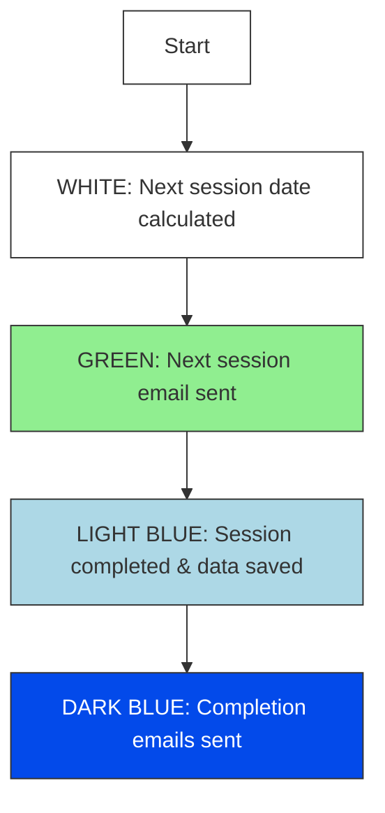
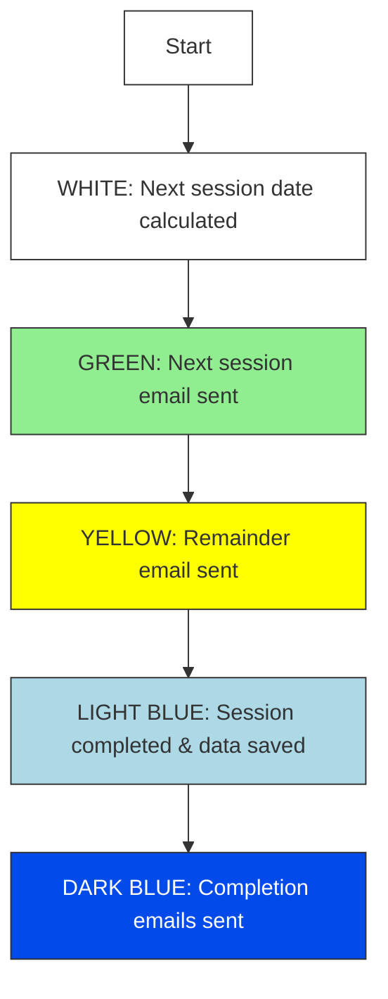
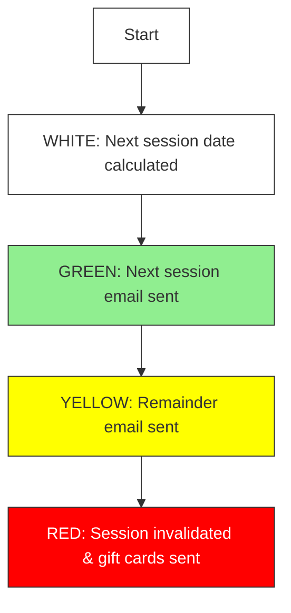
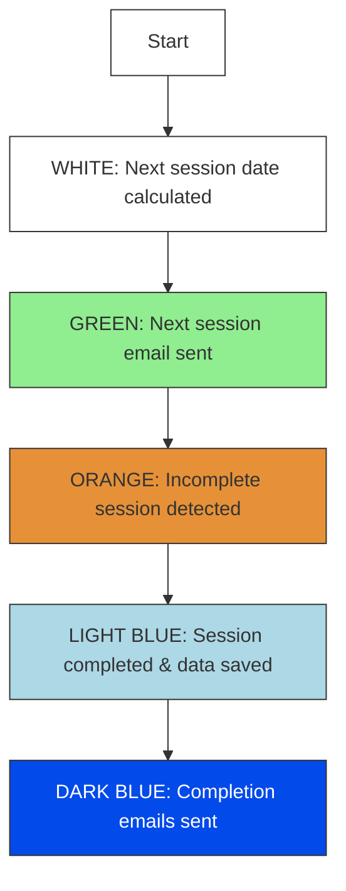
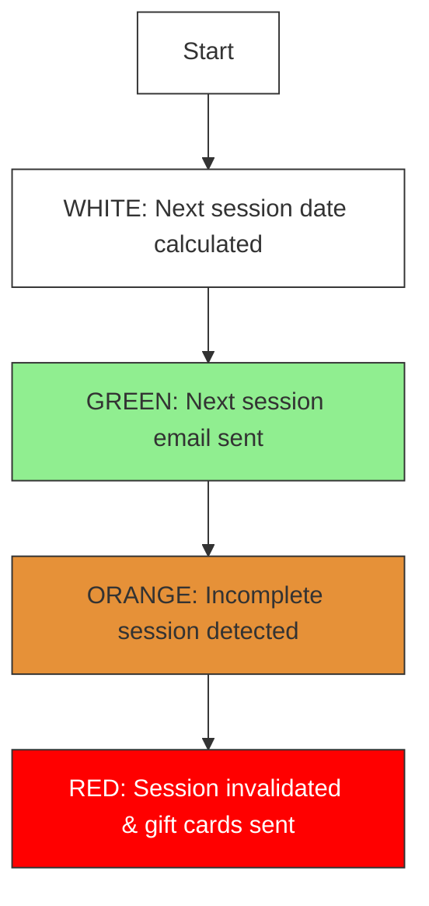
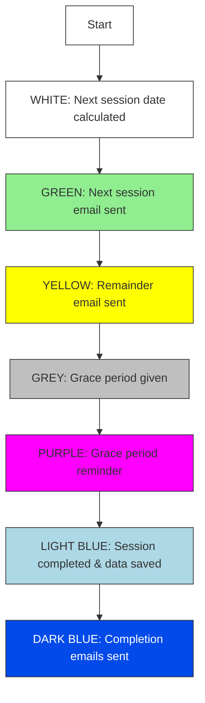
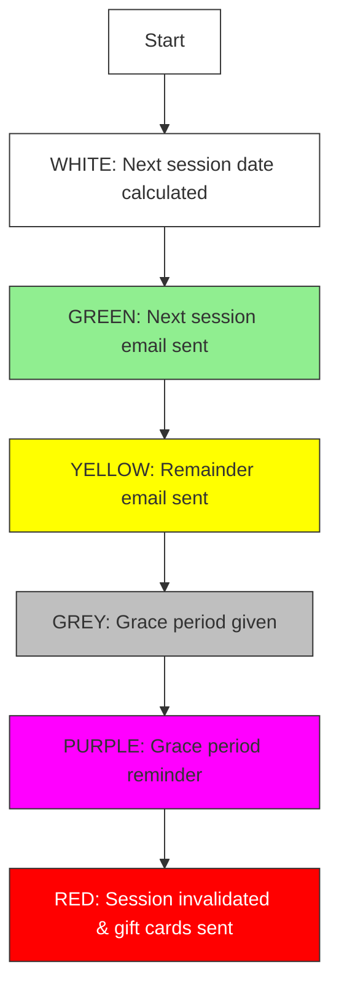

# GABLE: Google Apps Script Longitudinal Participant Management

GABLE is a Google Apps Script framework for managing participants in longitudinal online experiments. It automates scheduling, reminders, session tracking, and incentive workflows so researchers can focus on building their experimental task.

> GABLE manages participants and study flow. You are responsible for building and hosting the task webpage.

## Features

- Tracks multisession progress per participant
- Sends automated reminder and status emails
- Activates sessions based on configurable schedules
- Logs all activity in a Google Sheet
- Reads participant progress from your chosen storage backend
- Supports automated gift card tracking and payouts

## Quick Start

### 1. Google Apps Script Setup

1. Create a new Google Sheet
2. Go to Extensions → Apps Script
3. Copy all `.js` files into the project
4. Update `config.js`
5. Run `initialize()`
6. Confirm setup via email

### Essential Configuration (config.js)

At the top of `config.js`, set:

- `NUM_SESSIONS`
- `NUM_GROUPS`
- `DAYS_INTERVAL`
- `GROUPS_MAPPING`

Your study definition stays exactly as before:

```javascript
STUDIES = {
  GABLE_01: {
    name: "Your Study Name",
    admin_name: "Your Name",
    website: "https://your-task-page.com",
    preexperiment: "https://your-qualtrics-link.com",
    email: "your-email@example.com",
    folderID: "your-google-drive-folder-id",
    adminCalendarId: "your-calendar-id@google.com",

    sasToken: "?sv=xxxx",
    storageAccountName: "your-storage-account",
    storageContainer: "your-container-name",

    groups: {
      number: NUM_GROUPS,
      numSessions: NUM_SESSIONS,
      giftCardAmountPerSession: 5,
      giftCardAmountAfterCompletion: 100
    }
  }
};
```

The three storage fields above were originally described as Azure related. You can keep them as is or adapt them for any backend as long as your storage helper functions know how to use them. GABLE only requires the ability to read and write JSON.

## Integration with Your Task Webpage

Your task saves a JSON state file for each participant. It can be stored in Azure, AWS, GCP, Firebase, or any storage reachable through HTTP fetch. The filename format is customizable; in the current implementation it follows:

```
pID{userId}_gable.json
```

### Required JSON Structure

```json
{
  "userId": "fa4ae08",
  "group": "G11",
  "sessionNumber": 1,
  "trialNumber": 5,
  "firstTrialStartTime": "12/10/2025 10:35:00 AM",
  "sessionCompleted": true,
  "trialCompleted": true,
  "accountTerminated": false,
  "lastTrialCompletedTime": "12/10/2025 11:35:00 AM",
  "lastSessionCompletedTime": "12/10/2025 11:35:00 AM",
  "sessionActivationTime": "12/10/2025 10:30:00 AM",
  "latestSubmissionTime": "",
  "loginData": [],
  "trialStartTimesData": {},
  "trialCompletedTimesData": {},
  "sessionStartTimes": {},
  "sessionCompletedTimes": {}
}
```

### Fields Your Task Must Maintain

| Field | Description | Updated by |
|-------|-------------|------------|
| `sessionNumber` | Current session | Task |
| `trialNumber` | Current trial | Task |
| `sessionCompleted` | Session finished | Task |
| `trialCompleted` | Trial finished | Task |
| `firstTrialStartTime` | First trial time | Task |
| `lastTrialCompletedTime` | Last trial time | Task |
| `lastSessionCompletedTime` | Session completion time | Task |
| `latestSubmissionTime` | Every save | Task |
| `sessionActivationTime` | When session opened | GABLE |
| `accountTerminated` | Removed or dropped | Admin |

### Initial File Created by GABLE

```json
{
  "sessionNumber": 0,
  "trialNumber": 0,
  "sessionCompleted": true,
  "trialCompleted": true
}
```

## Workflow

1. **Sign up**: GABLE writes the participant to the Sheet and creates the initial JSON file
2. **Session activation**: GABLE opens the next session based on your timing rules
3. **Task participation**: Your webpage updates the JSON as the participant progresses
4. **Monitoring and email**: Scheduled checks read the JSON file and update Sheets and emails
5. **Completion and incentives**: Gift card logic tracks progress and completion payments

## Session Status Colors

GABLE uses color codes to track participant session states. Each color represents a specific stage in the session lifecycle:

- <span style="background:#ADD8E6; color:#000; padding:2px 6px; border-radius:3px;"><b>LIGHT BLUE</b></span>: It means the user finished the session, the data is saved to azure database but the session completion emails are not sent.
- <span style="background:#034AEA; color:#fff; padding:2px 6px; border-radius:3px;"><b>DARK BLUE</b></span>: It means that the user finished the session, the data is saved to azure database and the session completion emails are sent to the participants.
- <span style="background:#FFFF00; color:#000; padding:2px 6px; border-radius:3px;"><b>YELLOW</b></span>: It means that the user did not start the session but 1 days remained for the session due. The remainder emails are sent to the users.
- <span style="background:#FFF; color:#000; padding:2px 6px; border-radius:3px; border:1px solid #999;"><b>WHITE</b></span>: It means that the next session date is calculated for the participant. However, the email that informs the participants about the next session is not sent yet.
- <span style="background:#E69138; color:#000; padding:2px 6px; border-radius:3px;"><b>ORANGE</b></span>: It means that the user started this session but left it incomplete for 24 hours. We are sending incomplete session email for this situation.
- <span style="background:#FF0000; color:#fff; padding:2px 6px; border-radius:3px;"><b>RED</b></span>: It means that the participant is invalided since the session is not completed on time. Gift cards are also sent with the email that inform the participation about their invalidation.
- <span style="background:#90EE90; color:#000; padding:2px 6px; border-radius:3px;"><b>GREEN</b></span>: It means that the next session email is sent to the participant including the calendar invite and the begin-end dates for that particular session.
- <span style="background:#BFBFBF; color:#000; padding:2px 6px; border-radius:3px;"><b>GREY</b></span>: It means that the grace period is given to the participants (3 days in the current implementation) for sessions after 14. Sending emails regarding the status of the participant too.
- <span style="background:#FF00FF; color:#fff; padding:2px 6px; border-radius:3px;"><b>PURPLE</b></span>: It means that we already gave the grace period to the participant but 1 day remains for that grace period to end too. Sending emails regarding the status of the participant too.

### Common Session Flow Scenarios

#### 1. Successfully completed session on time:



#### 2. Succesfully Completed but Remainder Email is sent too:



#### 3. Session is Not Completed Successfully and Remainder Email is Sent:



#### 4. Session is Succesfully Completed but the user left session incomplete partially:



#### 5. Session is Not Completed Successfully and Incomplete Session Email is Sent:



#### 6. After Session 15: Session is completed but after grace period reminder



#### 7. After Session 15: Session is not completed but after grace period reminder



## Time Based Triggers

Initialization creates triggers that:

- Activate sessions
- Send reminders
- Poll the storage JSON files
- Update Sheets
- Create optional summaries

## Testing and Customization

### Testing

Use a few test participants and confirm session changes, email behavior, and JSON updates.

### Customization

Edit in `config.js` and email templates:

- Session spacing
- Group definitions
- Payout amounts
- Allowed windows for completion
- Storage helper functions

## License

Add your license text here.